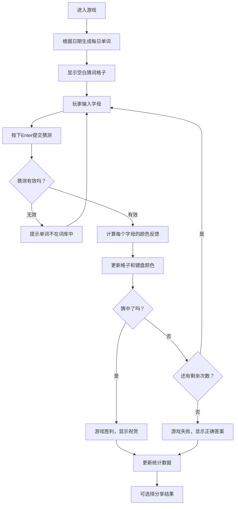

## 1. 产品概述

Wordle猜词游戏是一款经典的文字益智游戏，玩家需要在6次机会内猜出一个5个字母的单词。游戏通过颜色反馈系统引导玩家逐步缩小答案范围，结合每日一词、多语言支持、统计追踪和社交分享功能，为用户提供有趣且富有挑战性的游戏体验。

### 核心价值
- 提供轻松有趣的每日益智挑战
- 支持多语言学习（英语、中文拼音、西班牙语）
- 通过统计数据追踪游戏进度和成就
- 便捷的结果分享功能增强社交互动

## 2. 核心功能

### 2.1 用户角色
| 角色 | 注册方式 | 核心权限 |
|------|----------|----------|
| 普通用户 | 无需注册，本地存储 | 进行游戏、查看统计、切换语言、分享结果 |

### 2.2 功能模块
1. **游戏主界面**：猜词格子区域、虚拟键盘、语言切换、统计按钮、分享按钮
2. **颜色反馈系统**：绿色（位置正确）、黄色（字母存在但位置错误）、灰色（字母不存在）
3. **多语言词库**：英语、中文拼音、西班牙语三种语言模式
4. **每日一词**：基于日期生成固定单词，每日更新
5. **统计系统**：游戏场次、胜率、当前连胜、最高连胜记录
6. **分享功能**：生成文本格式的格子图，可复制分享
7. **猜测历史**：显示所有已提交的猜测及其颜色反馈

### 2.3 页面详情
| 页面名称 | 模块名称 | 功能描述 |
|----------|----------|----------|
| 游戏主页 | 猜词格子区域 | 5x6的格子矩阵，显示当前输入和历史猜测 |
| 游戏主页 | 虚拟键盘 | 显示字母按键，按键颜色随猜测结果更新 |
| 游戏主页 | 顶部工具栏 | 语言切换、统计面板按钮、帮助按钮、分享按钮 |
| 游戏主页 | 统计弹窗 | 显示游戏统计数据和历史记录图表 |
| 游戏主页 | 游戏结束弹窗 | 显示结果、答案、分享按钮 |

## 3. 核心流程

### 游戏主流程

## 4. 用户界面设计

### 4.1 设计风格
- **主色调**：深色背景（#121213），配合鲜明的反馈色
- **反馈颜色**：
  - 绿色：#538d4e（位置正确）
  - 黄色：#b59f3b（字母存在但位置错误）
  - 灰色：#3a3a3c（字母不存在）
- **按钮风格**：圆角矩形，悬停时有轻微缩放效果
- **字体**：现代无衬线字体，粗体显示字母
- **布局风格**：居中对称布局，顶部工具栏，中间游戏区，底部键盘
- **图标风格**：简约线性图标，使用lucide-react

### 4.2 页面设计概述
| 页面名称 | 模块名称 | UI元素 |
|----------|----------|----------|
| 游戏主页 | 顶部工具栏 | 语言选择下拉、统计图标、帮助图标、分享图标 |
| 游戏主页 | 猜词格子区域 | 5列6行的方形格子，字母居中显示，背景色随状态变化 |
| 游戏主页 | 虚拟键盘 | 三行字母按键，Backspace和Enter按键加宽 |
| 统计弹窗 | 统计面板 | 大号数字显示统计数据，柱状图显示猜测分布 |
| 游戏结束弹窗 | 结果面板 | 显示胜利/失败状态、答案、分享按钮 |

### 4.3 响应式设计
- **桌面端**：固定宽度布局，键盘按键较大
- **移动端**：自适应宽度，键盘按键适当缩小，支持触摸操作
- **横屏优化**：调整格子大小，确保完整显示

### 4.4 动画效果
- 字母输入时格子轻微弹跳
- 提交猜测后格子翻转动画显示颜色
- 胜利时格子有庆祝动画
- 弹窗淡入淡出效果
- 键盘按键点击反馈
