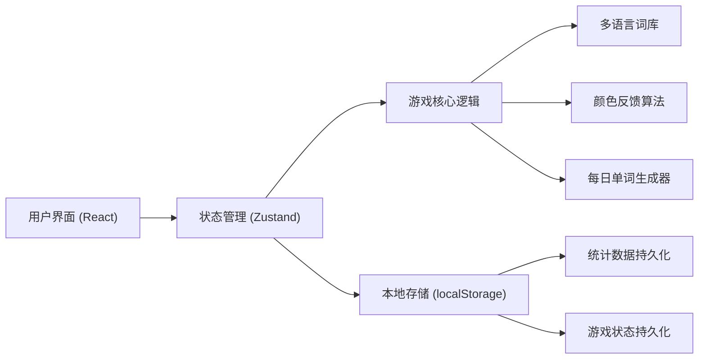

## 1. 架构设计



## 2. 技术描述

- **前端框架**：React@18 + TypeScript
- **构建工具**：Vite@5
- **样式方案**：Tailwind CSS@3
- **状态管理**：Zustand
- **图标库**：lucide-react
- **数据持久化**：localStorage
- **包管理器**：npm（Windows环境）

## 3. 项目结构

```
src/
├── components/
│   ├── Board.tsx          # 猜词格子面板
│   ├── Cell.tsx           # 单个格子组件
│   ├── Keyboard.tsx       # 虚拟键盘
│   ├── Key.tsx            # 单个按键组件
│   ├── Header.tsx         # 顶部工具栏
│   ├── StatsModal.tsx     # 统计弹窗
│   ├── GameOverModal.tsx  # 游戏结束弹窗
│   └── HelpModal.tsx      # 帮助弹窗
├── hooks/
│   ├── useGameLogic.ts    # 游戏逻辑Hook
│   └── useDailyWord.ts    # 每日单词Hook
├── store/
│   └── useGameStore.ts    # Zustand状态管理
├── data/
│   ├── words-en.ts        # 英语词库
│   ├── words-es.ts        # 西班牙语词库
│   └── words-pinyin.ts    # 中文拼音词库
├── utils/
│   ├── wordleLogic.ts     # 颜色反馈算法
│   ├── dailyWord.ts       # 每日单词生成
│   └── shareUtils.ts      # 分享功能
├── types/
│   └── index.ts           # TypeScript类型定义
├── App.tsx
├── main.tsx
└── index.css
```

## 4. 核心数据结构

### 类型定义
```typescript
type LetterStatus = 'correct' | 'present' | 'absent' | 'empty';
type Language = 'en' | 'es' | 'pinyin';

interface CellState {
  letter: string;
  status: LetterStatus;
}

interface GuessResult {
  cells: CellState[];
}

interface GameState {
  targetWord: string;
  currentGuess: string;
  guesses: GuessResult[];
  gameStatus: 'playing' | 'won' | 'lost';
  language: Language;
  keyStatus: Record<string, LetterStatus>;
}

interface Statistics {
  gamesPlayed: number;
  gamesWon: number;
  currentStreak: number;
  maxStreak: number;
  guessDistribution: number[];
  lastPlayDate: string;
}
```

## 5. 核心算法

### 5.1 颜色反馈算法
```
输入: guess (猜测单词), target (目标单词)
输出: 每个字母的状态数组

1. 初始化所有字母状态为 'absent'
2. 第一次遍历：标记位置正确的字母为 'correct'
3. 统计目标单词中未被标记的字母出现次数
4. 第二次遍历：对于非 'correct' 的字母
   - 如果字母在目标单词中且还有剩余次数
   - 标记为 'present' 并减少剩余次数
5. 返回状态数组
```

### 5.2 每日单词生成算法
```
输入: date (日期), wordList (词库)
输出: 固定单词

1. 将日期转换为字符串格式 YYYY-MM-DD
2. 计算日期字符串的哈希值
3. 使用哈希值对词库长度取模得到索引
4. 返回词库中对应索引的单词
```

## 6. 本地存储键定义

| 键名 | 类型 | 用途 |
|------|------|------|
| `wordle_stats` | Statistics | 游戏统计数据 |
| `wordle_game_{date}` | GameState | 当日游戏状态 |
| `wordle_language` | Language | 用户选择的语言 |

## 7. 分享格式

```
Wordle {日期} {猜测次数}/6

🟨⬜⬜🟩⬜
🟩🟨⬜⬜🟨
🟩🟩🟩🟩🟩
```

- 🟩 = 绿色（correct）
- 🟨 = 黄色（present）
- ⬜ = 灰色（absent）
